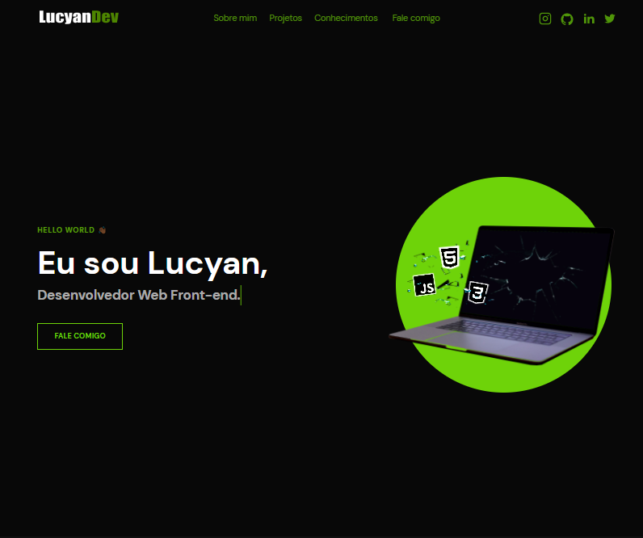

<h1 align="center">Portifólio - Lucyan 💻</h1>

<h4 align="center"><a href="https://lucyanovidio.vercel.app">Confira o projeto aqui</a></h4>

---

### 👨🏿‍💻 Sobre

Projeto feito no intuito de me apresentar, como desenvolvedor web front-end.

## 🤯 O site é composto por:

- **Home:** Minha apresentação;
- **Sobre mim:** Falo um pouco sobre minha trajetória e meu estado atual;
- **Projetos:** Alguns projetos recentes que fiz;
- **Conhecimentos:** As técnologias que tenho conhecimento;
- **Fale comigo:** Área com meios para contato comigo;
- **Redes:** Minhas redes sociais disponíveis no menu de navegação e no rodaé do site.

## 🧠 Tecnologias utilizadas:

O site **ainda está em desenvolvimento** pois estou em constante aprendizado, mas até aqui utilizei apenas:

- **HTML**
- **CSS**
- **JavaScript**

---

<table>
  <tr>
    <td>
      
    </td>
    <td>
      Feito por <a href="https://linkedin.com/in/lucyanovidio">Lucyan Ovídio.</a> 🙋🏿‍♂️
    </td>
  </tr>
</table>
